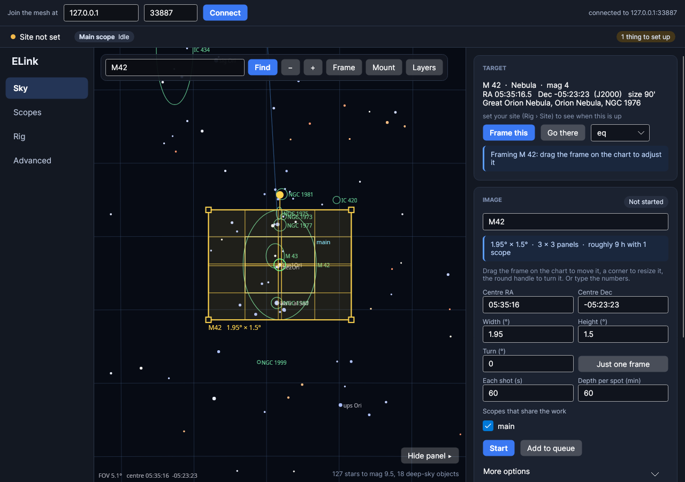
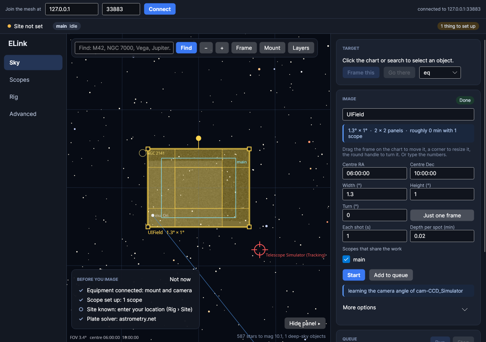
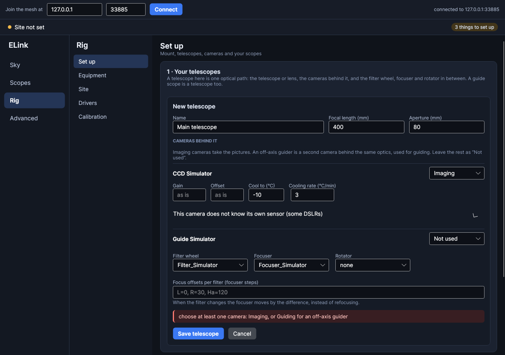

# ELink

An astronomy control stack in the spirit of Ekos and N.I.N.A., built differently: every piece of equipment, every
smart scope and the UI is an endpoint on **EVent**, a distributed event/dRPC mesh. C# / .NET 8, Avalonia UI, INDI for
the hardware.



> **Status:** early. Everything below runs and is tested against the INDI simulators (240 automated tests, including a
> headless run of the whole UI), but it has not yet had a night on real hardware. Expect rough edges.

## The idea

- **One request: "this image of this part of the sky."** An area (a single frame is just a small one), a depth and an
  output pixel scale. Any number of scopes pull work from it, each with its own cameras, and a live stack of all their
  frames is the image. There is no separate mosaic mode and no keeping scopes in sync.
- **Autonomous smart scopes.** Guiding, dithering, centring after slews, autofocus triggers, meridian flips, cooling
  and frame grading all live inside the scope. Nothing above it coordinates them.
- **Flexible composition.** An *imaging train* is one optical path: optics, imaging cameras, an off-axis guider,
  filter wheel, focuser, rotator. A smart scope carries any number of trains on a mount and guides with whichever
  train or OAG camera you assign. Scopes are Pointers and Shooters themselves, so they nest.
- **Nothing references anything else.** Modules share only contract types and IDs (`src/ELink.Contracts`), all
  messages are binary NOTES types (no JSON over the wire), and a test enforces that the UI never references a backend.
  The UI can run in its own process on another machine.
- **Standard INDI.** Mounts, cameras (DSLRs too), focusers, wheels, rotators, domes, weather and GPS are driven through
  the standard INDI properties, the same ones Ekos uses, so no vendor SDKs are involved.

## Features

| | |
|---|---|
| **Imaging** | area filling shared between scopes, dither on every shot, resume across nights under the image's name |
| **Scheduler** | queue of images with priorities, altitude/horizon, darkness, Moon distance and brightness, time windows; carries on night after night |
| **Live stack** | sky registration (WCS, plate solve or pointing) into a fixed field at any pixel scale, debayering (interpolated or super pixel), outlier rejection, flux matching across cameras, one stack per filter, dark/flat calibration |
| **Calibration** | master darks, biases and flats per camera; flats find their own exposure; matched by exposure, gain, temperature, binning, filter |
| **Guiding** | multi-star guider in each scope, PHD2-style calibration over INDI pulse guiding, dither and settle, or "you are here, should be here" corrections for devices that close the loop |
| **Focus** | HFR autofocus; triggers per train (start, time, temperature, filter, star growth); per-filter offsets |
| **Pointing** | plate solving (ASTAP and/or astrometry.net), centring by aim-off, learned pointing correction, meridian flip |
| **Cameras** | gain/offset presets, slow cooling ramps with the scope waiting until cold, frame grading (clouds, trailing, soft focus) |
| **Sky** | atlas from KStars data plus OpenNGC and GSC, site and twilight, Sun/Moon/planets, horizon profile, Stellarium bridge |
| **Equipment** | equipment profiles (ELink runs the INDI drivers itself and restarts a dying server), raw INDI property browser |

| | |
|---|---|
|  |  |

## Quick start

Requirements: Linux, the [.NET 8 SDK](https://dotnet.microsoft.com/download), and [INDI](https://indilib.org)
(`indiserver` and drivers). Optional: KStars' sky data (for the atlas), [ASTAP](https://www.hnsky.org/astap.htm) with a
star database and/or astrometry.net's `solve-field` (for plate solving).

```bash
git clone https://github.com/UltraGeekDEV/ELink-Astro.git
cd ELink-Astro
./dev.sh build
```

Try it on the simulators:

```bash
indiserver indi_simulator_telescope indi_simulator_ccd indi_simulator_wheel indi_simulator_focus &
dotnet run --project src/ELink.Station -- --indi localhost:7624
```

With your own rig, list its drivers once under **Rig › Drivers** and start them from there (or
`elink --profile NAME`): ELink runs its own indiserver. The bridge and the UI can also run as separate processes on
one mesh:

```bash
dotnet run --project src/ELink.Bridge -- --indi localhost --port 5698
dotnet run --project src/ELink.App -- --host 127.0.0.1 --port 5698
```

Then connect your equipment and set up a telescope and a scope under **Rig**, and ask for an image on the **Sky**: pick a
target, press *Frame this*, drag the frame where you want it, press *Start*. The status strip along the top says what is
still to set up.

## Documentation

- [User guide](docs/user-guide.md): the five views, the picture page, setting up a rig, imaging an area, troubleshooting.
- [Developer guide](docs/development.md): architecture and the design spec, patterns, IDs, adding devices and services, testing.
- [Roadmap](TODO.md).

## Layout

| project | what |
|---|---|
| `ELink.Contracts` | NOTES types and IDs: equipment, Pointer/Shooter/Scope/Train, automation services |
| `ELink.Core` | node helpers, `RemoteState`, `StatePublisher`, `Commands`, astro math |
| `ELink.Indi` | INDI XML protocol client with a live property model |
| `ELink.IndiBridge` | INDI ↔ EVent: a generic mirror of every property, typed adapters per device kind, equipment profiles |
| `ELink.Compose` | smart scopes, imaging trains, mount pointers, camera shooters, guiders, the composition host |
| `ELink.Imaging` | FITS, TAN WCS, live stacker, debayering, star detection and HFR, frame grading, calibration |
| `ELink.Automation` | image requests, scheduler, autofocus, plate solving, centring, live stacking, calibration library, storage, site |
| `ELink.Atlas` / `ELink.Stellarium` | sky atlas service; Stellarium telescope server and Remote Control client |
| `ELink.UI` / `ELink.App` | Avalonia UI and its stand-alone executable |
| `ELink.Bridge` / `ELink.Station` | headless INDI bridge; all-in-one `elink` (bridge, services and UI on one node) |

EVent is not on nuget.org; it lives in `EVent/` and its packages are in `EVent/nuget/` (a local feed, see `nuget.config`).

## Developing

`./dev.sh build|test` wraps `dotnet` without resident build servers (they pile up and eat gigabytes of RAM). The
integration tests start real `indiserver` simulators in a throwaway `HOME` and are skipped when INDI is not installed;
plate-solve tests run when a solver is found.

## License

[GPL-3.0](LICENSE), the same family as KStars/Ekos.
