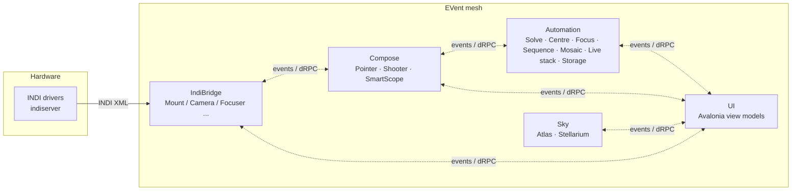
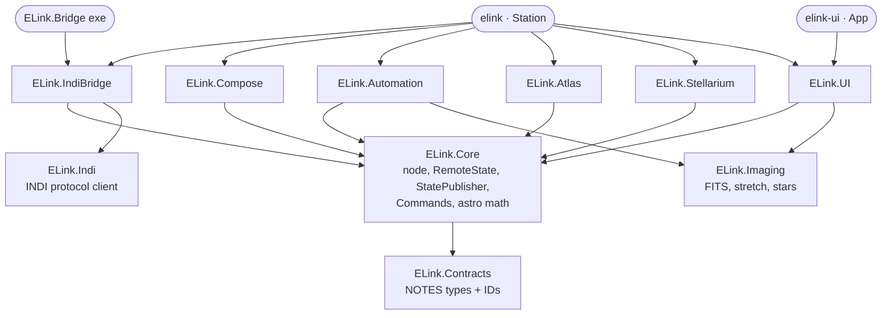
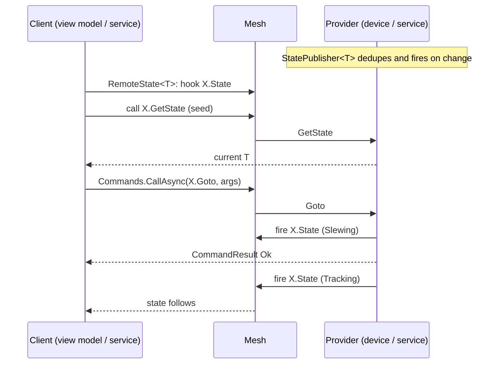
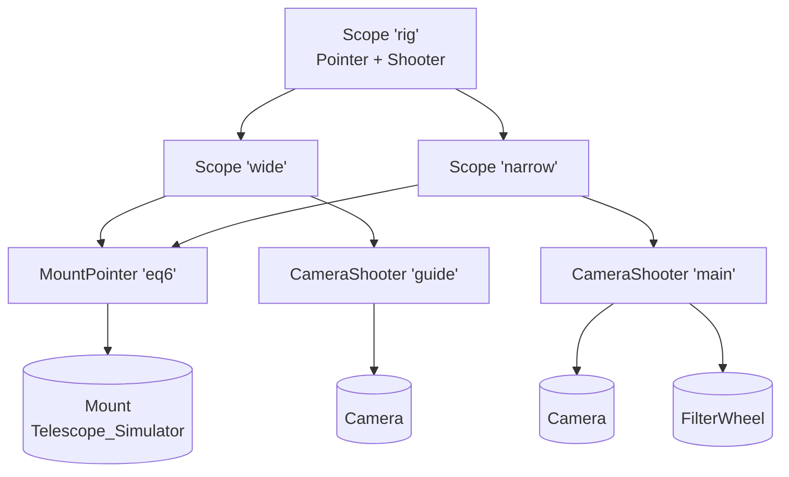
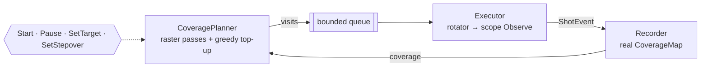
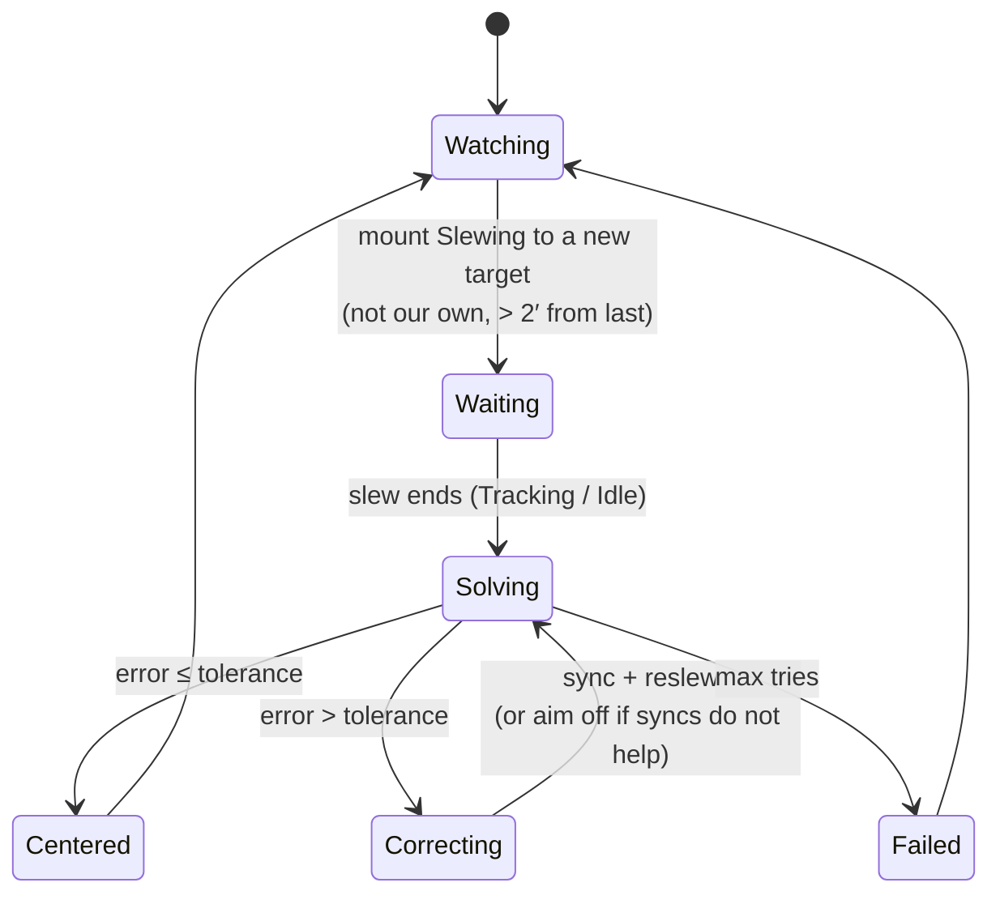
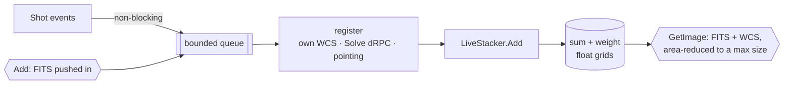

# ELink — developer guide

How ELink is built, the rules it keeps, and how to add to it. For using it, see the [user guide](user-guide.md).

## The one rule

Modules never reference each other. They share **contract types** (`ELink.Contracts`) and **EVent IDs**, nothing else.
Every device, service and view model is a set of EVent endpoints on a mesh node. Two pieces of code that talk to each
other can sit in one process (EVent local loopback: a cheap in-process event bus) or on two machines, with no code change.



Dotted lines are mesh traffic, not references. `ArchitectureTests` fails the build if `ELink.UI` references any backend
project.

## Projects



`ELink.Indi` knows nothing of EVent; `ELink.Imaging` knows nothing of either. Executables are the only place where
backends meet, and they meet only by being started on the same node.

## ID scheme

| pattern | example | kind |
|---|---|---|
| `ELink.<Kind>.<Id>.State` | `ELink.Mount.Telescope_Simulator.State` | event: state, fired on change |
| `ELink.<Kind>.<Id>.GetState` | `ELink.Camera.CCD_Simulator.GetState` | function: current state for late joiners |
| `ELink.<Kind>.<Id>.<Command>` | `ELink.Pointer.eq6.Goto` | function: command, returns `CommandResult` |
| `ELink.Shooter.<Id>.Shot` | `ELink.Shooter.main.Shot` | event: a frame (`ShotEvent`, FITS bytes + pointing) |
| `ELink.Automation.<Service>.*` | `ELink.Automation.Mosaic.Start` | service commands and state |
| `ELink.Devices.Announce` / `.List` | | device directory |
| `ELink.Indi.<server>.<device>.<property>` | | generic mirror of every INDI property |

IDs live as constants or helpers next to their types in `ELink.Contracts` (`EquipmentIds`, `PointerIds`, `ShooterIds`,
`MosaicIds`, ...). Never type an ID string anywhere else.

## The state + command pattern

Every endpoint (device, scope, service) has the same shape, built from three helpers in `ELink.Core`:



- **`StatePublisher<T>`**: holds the last state, fires the event only when it changed, answers `GetState`.
- **`RemoteState<T>`**: hooks the event and seeds itself with `GetState`, so a late joiner is never blind.
- **`CommandSet` / `Commands.CallAsync`**: register command functions; calling one folds every provider's dRPC answer
  into one `CommandResult` (no provider = not ok).
- Publish the new state **before** returning "accepted", so a caller that waits on state never sees the old one.

EVent typed events are acknowledged synchronously: a slow subscriber stalls the publisher. Keep handlers short; hand
heavy work (solving, stacking, saving) to a queue.

## Composition

A *Pointer* is anything that can be pointed at the sky, a *Shooter* anything that takes frames. A **SmartScope** is
`pointers[] + shooters[]` and is registered as both a Pointer and a Shooter under its own id, so scopes nest.



`Observe` = go to, wait until every pointer settles, expose every shooter N times. Each `ShotEvent` carries the leaf
shooter id, the J2000 pointing and the `ObjectName` / `PlanId` of the request, so consumers never have to guess what a
frame belongs to. Shooters have offsets (arcmin east/north of the pointing axis); the primary shooter is the one centred.

## Services

| service | listens to | drives | notes |
|---|---|---|---|
| Autofocus | shooter shots | focuser | HFR per position, parabola fit on HFR², coarse + fine |
| Sequencer | weather state | scope `Observe`, autofocus | blocks, pause/resume, weather interlock |
| Storage | any shooter's shots | disk | night folders, FITS headers, JSON-lines log |
| Mosaic | its own plan | scope, rotator | coverage map painter (below) |
| PlateSolve | — | shooter (optional) | wraps `solve-field`, one solve at a time |
| Centering | mount state (incl. hand-controller slews) | mount, PlateSolve | sync + reslew, aim-off fallback, guide→primary offset |
| LiveStack | any shooter's shots | PlateSolve (optional) | registers frames, resamples into a fixed sky grid |
| Atlas | — | — | KStars stars, OpenNGC, GSC, constellations, search |
| Stellarium | a pointer | pointer | telescope protocol server + Remote Control client |

### Mosaic painter



The virtual FOV is a `CoverageMap` of exposure seconds. Each frame is a rotated rectangle (`FrameSpec`) relative to the
scope pose; one shot deposits its exposure into every cell under every frame. Raster passes use a hop derived from the
target depth on an aligned lattice, shifted between passes; the top-up picks the visit with the best D²/(D+penalty·W).

### Centring loop



The guide camera is aimed at `target − offset` (offset negated across a pier flip), so the primary lands on target.

### Live stacking



`LiveStacker` (in `ELink.Imaging`, no EVent) owns the output grid, a `TanWcs` built from the requested centre,
angle and scale. Each frame is mapped through the **exact homography** between its TAN WCS and the grid (two
gnomonic projections of one sphere are related by a plane homography), so there is no per-pixel trigonometry.

| ratio r = output scale / frame scale | how |
|---|---|
| r < 1 (output finer) | sample the frame with Catmull-Rom bicubic (or bilinear / nearest) |
| 1 ≤ r < 2 | average ⌈r⌉² bilinear samples spread over each output pixel |
| r ≥ 2 | box-bin the frame by ⌊r⌋ first (exact area average, WCS follows), then as above |

Raw one-shot-colour frames go through `Debayer` (`ELink.Imaging`) before resampling: *SuperPixel* turns each 2×2
cell into one RGB pixel and the frame's WCS follows with `LiveStacker.Binned(wcs, 2)`; *Interpolated* is a bilinear
demosaic on the same grid (the mean of same-colour pixels in the 3×3 neighbourhood, exact for linear data). The raw
frame is what gets plate solved. The stacker is planar with 1 or 3 channels, fixed by its first frame; mono frames
go into a colour stack as grey and colour frames into a mono stack as luminance.

Partial edge pixels add a fractional weight, the mean is sum/weight, and each frame's background median is matched
to the first frame's, per channel. Memory is 8 bytes per output pixel (16 in colour), capped by `MaxMegapixels`.

## Coordinates

All mesh coordinates are **J2000** unless a field says otherwise. INDI mounts speak JNow (`EQUATORIAL_EOD_COORD`);
the mount adapter and `Precession` (IAU 1976) convert at the edge. `ELink.Core.Astro` has the shared math: `Sky`
(separation, offsets), `Gnomonic` (tangent plane), `SkyProjection` (stereographic, north up, east left),
`Sexagesimal`, `FieldOfView`, `Coverage`.

## Adding things

**A device kind** (say a light panel):
1. Contract in `ELink.Contracts/Equipment`: a NOTES state type and an ID helper class over `EquipmentIds`.
2. Adapter in `ELink.IndiBridge/Adapters` mapping the *standard* INDI properties (the ones Ekos uses), registered in
   `IndiEquipmentManager` by `DRIVER_INTERFACE` bit.
3. A panel view model in `ELink.UI` that only uses `RemoteState` + `Commands`.
4. An integration test against the INDI simulator.

**A service**: a class taking a `TypeSafeEVentNode`, a `StatePublisher` for its state, a `CommandSet` for its commands,
`StartAsync` / `DisposeAsync`. Host it in `ELink.Station/Program.cs`. Talk to equipment only through its IDs.

**A NOTES type**: subclass the binary-convertible base with a static `NOTESDescriptor`; register every field. Do not
name a field `Name` (it collides with the type-name override). `.Range` takes decimals (`0m, 100m`).
Binary payloads use `RawBytes`.

## Building and testing

```bash
./dev.sh build
./dev.sh test --nologo
./dev.sh test tests/ELink.Tests --filter "FullyQualifiedName~Mosaic"
```

`dev.sh` disables MSBuild node reuse and the shared compiler: resident build servers pile up to gigabytes on this
machine. Always build through it.

- Integration tests start real `indiserver` simulators with a throwaway `HOME` and their own socket (`-u`); tests that
  move a mount or depend on its pointing start their own server rather than share the `indiserver` collection fixture.
- Ports come from `ELink.Testing.TestPorts`.
- Plate-solve tests run when `solve-field` is found (`ELINK_SOLVE_FIELD`, `~/.local/astrometry/bin/solve-field`, PATH).
- Live Stellarium tests: `ELINK_LIVE_STELLARIUM=1`.
- UI tests run Avalonia headless and assert on rendered pixels.

### Gotchas

- `TypeSafeEVentNode`'s constructor blocks on its own async start-up; on a busy synchronization context (the UI thread)
  that deadlocks. Always create nodes with `ElinkNode.Create` / `CreateAsync`, which build them on a pool thread.
- The INDI CCD simulator renders where the mount *reports* it is, plus guide-pulse offsets; syncs do not change that.
- The CCD simulator is also a filter wheel: wait on exact device ids, not on "a wheel appeared".
