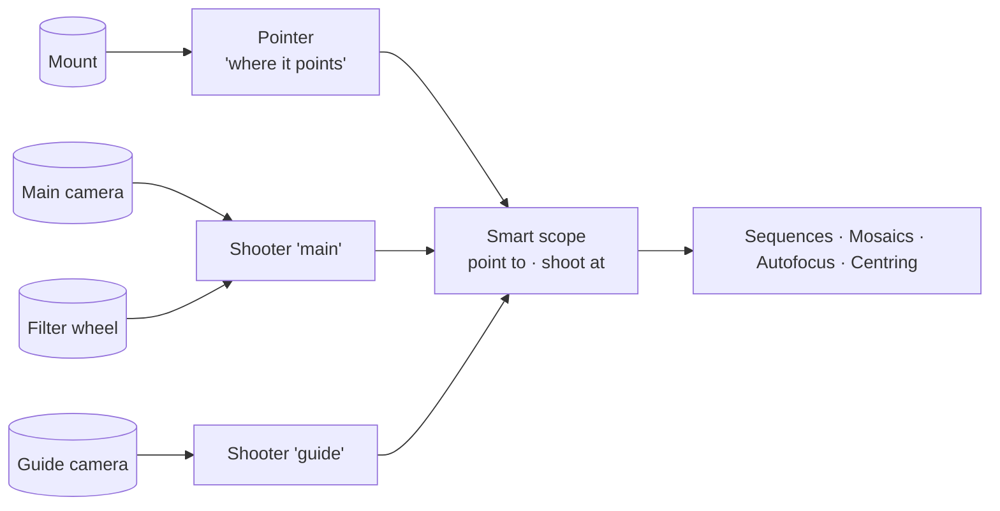
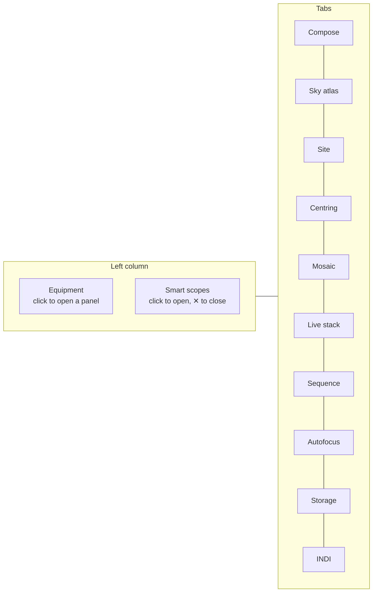
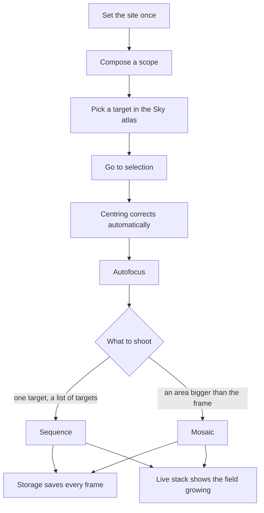
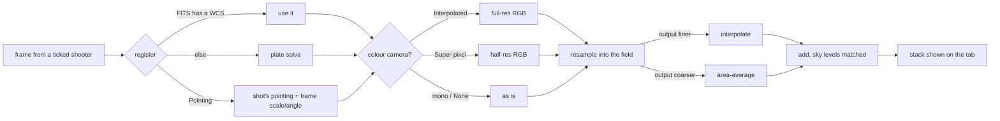

# ELink — user guide

How to run ELink and use each part of it. For how it is built, see the [developer guide](development.md).

## The idea in one picture



You turn equipment into **pointers** (a mount) and **shooters** (a camera, optionally with a filter wheel), then combine
them into **smart scopes**. Everything else (sequences, mosaics) works on scopes. A scope can contain other scopes, so a
dual-rig or a two-mount setup is just another scope.

## Starting

You need `indiserver` with your drivers (or the simulators), and the EVent package in `nuget/`.

```bash
indiserver indi_simulator_telescope indi_simulator_ccd indi_simulator_wheel indi_simulator_focus
```

```bash
dotnet run --project src/ELink.Station -- --indi localhost:7624
```

That starts everything (INDI bridge, scopes, services, sky atlas, Stellarium link) and opens the window.

| option | meaning | default |
|---|---|---|
| `--indi host[:port][=name]` | an indiserver to bridge; repeat for several | `localhost:7624` |
| `--port N` / `--listen IP` | mesh port and interface for other ELink processes | `5698`, loopback |
| `--compose file.json` | where scope definitions (and the centring offset, next to it) are kept | `~/.config/elink/compose.json` |
| `--save-dir DIR` / `--save SHOOTER` | save frames of a shooter from the start | — |
| `--stellarium-port N` | telescope port Stellarium connects to | `10001` |
| `--stellarium-remote URL` | Stellarium Remote Control | `http://127.0.0.1:8090` |
| `--sky-data DIR` | KStars sky data | `/usr/share/kstars` |
| `--no-ui` | headless; connect a UI later | — |

**UI on another machine**: run the station with `--no-ui --listen 0.0.0.0`, then on the other machine:

```bash
dotnet run --project src/ELink.App -- --host <station-ip> --port 5698
```

## The window



The top bar shows the mesh you are on (**Connect** joins another). **↻** asks the mesh for equipment again.

### Equipment panels

Each device has a panel: mount (go to, park, tracking, abort), camera (expose, cooler, binning, latest frame),
focuser, filter wheel, rotator, dome, weather, GPS. They show what the driver supports. The focuser panel covers what
Ekos does: absolute and relative moves, timed moves, abort, sync, reverse, backlash, max travel, speed and temperature.

## Typical night



## Compose

1. **Pointer from a mount**: give it an id (`eq6`), pick the mount, *Define pointer*.
2. **Imaging train**: one telescope (or lens) and what sits behind it: an id, a label, the focal length and
   aperture, and a role for each camera: **Imaging**, or **Guiding** for an off-axis guider in the same train. Add
   the filter wheel, focuser and rotator if it has them. A guide scope is just another train. The train tells its
   cameras the focal length, so frames carry it and plate scales are known.
3. **Smart scope**: id and name, tick the pointers and the trains: as many trains as ride on the mount (a main
   scope and a wide-field, say), each with its offset from the pointing axis in arcminutes (0 for the main one).
   **Guide with**: another train (a guide scope), a train's off-axis guider (`<train>-guide`), or no guiding.
   Pulses go to the mount's own guide port unless you pick another (a camera's ST4 port); **Correction** sends
   "you are here, should be here" to a device that moves itself instead. Set how often to **dither** (every N
   exposure rounds) and by how many guide-camera pixels. A guided scope does everything itself: it stops guiding
   before any slew, starts (and calibrates the first time) once on target, waits until guiding has settled before
   each exposure, and dithers between them.

Definitions are saved and come back on the next start. A defined scope appears under *Smart scopes* on the left; its
panel has **Observe** (go to, wait until settled, take *Count* frames), *Go to only*, *Expose only* and *Abort*.
Coordinates are typed as `5:35:17` / `-5:23:28` or decimal; pick the epoch (J2000 or JNow).

A guided scope's panel also has a **Guiding** card: phase (calibrating, guiding, settled), RMS in arcseconds, the
calibration, a graph of the last 100 RA (blue) and Dec (red) errors, and Start / Stop / Recalibrate / Dither now.
You do not need these for normal work: the scope guides by itself.

## Sky atlas

- Drag to pan, wheel to zoom, click a star or object to select it.
- Search: `M42`, `NGC 7000`, `Vega`, `andromeda`.
- Mounts are drawn as reticles where they point. *Centre on mount* jumps there.
- **Go to selection** sends the chosen pointer or scope there. **Use as mosaic centre** fills the Mosaic tab.
- **Stellarium**: *Show selection in Stellarium*, *Take Stellarium's selection*, and *Stellarium follows this pointer*.

### Stellarium setup

1. Telescope Control → add telescope → **External software or a remote computer**, host `localhost`, port `10001`,
   equinox **J2000**. Stellarium now shows the pointer, and Ctrl+1 slews it to Stellarium's selection.
2. For the show/take buttons, enable the **Remote Control** plugin (port 8090).

## Site

Set this once: latitude and longitude (degrees, `47.5` or `47:29:52`; east longitudes positive), elevation, or
pick a **GPS** device to take them from (it also reports how far this computer's clock is off). **Lowest altitude**
and the **obstructions** list (`azimuth:altitude` pairs, e.g. `180:10, 200:35, 260:35, 280:10` for a house to the
south-west) describe your real horizon. With *Give the mounts this location and the time* ticked, every mount gets
them when it connects, as Ekos does.

The tab then shows tonight: whether it is day, twilight or night, the Sun's altitude, sidereal time, astronomical
dusk and dawn, the Moon (phase, altitude, rise and set) and where the planets are. The Sky atlas draws your horizon
(green line, N/E/S/W), the Sun, Moon and planets, finds planets by name, and for any selection says its altitude now,
when it rises, culminates and sets above *your* horizon, how many dark hours it is up, and how far it is from the Moon.

## Centring (plate solving)

Needs astrometry.net's `solve-field`. A user-space copy in `~/.local/astrometry` is found automatically
(or set `ELINK_SOLVE_FIELD`).

1. Pick the **mount**, the **guide camera** (it is solved) and the **primary camera**. Set exposure, tolerance (arcmin)
   and max tries. Tick *Sync the mount* and *Centre automatically after every slew*. **Apply**.
2. From now on, every slew to a new target is centred, also slews from a hand controller or other software.
3. **Learn offset** (once, pointing anywhere with stars): both cameras are solved, and the guide-to-primary offset is
   stored. Tick *Centre the primary*: the guide scope is then aimed so that the **primary** lands on the target.
   The guide scope and the primary do not need to be aligned. The offset is turned over after a meridian flip.
4. *Centre now* re-centres on the current target; *Solve guide frame* just reports where you are.

If the mount's syncs do not move its pointing, centring notices and aims off by the measured error instead.

## Autofocus

Pick the shooter and the focuser, exposure, step size and number of samples, **Run**. It sweeps the focuser, measures
star size (HFR), fits the curve and moves to the best position. The focus curve is drawn as it goes.

## Sequence

A plan is a list of blocks: target, exposure seconds, count, filter, frame type, and *Refocus before*. Pick the scope,
optionally a weather device (unsafe weather pauses, and the plan resumes with only the missing frames) and the
autofocus shooter/focuser for refocus blocks. **Start**, **Pause**, **Resume**, **Abort**.

## Mosaic

Paints an area bigger than one frame, Seestar style: many single shots in small steps, each one aimed at the least
covered part, until every spot has received the target exposure.

1. **Area to paint**: centre (or *Use as mosaic centre* from the atlas), width, height, angle.
2. **Frames**: one row per camera on the scope: size, rotation and offset in degrees. *Frame 1 from camera* fills
   it from a camera and a focal length. Frames may differ (different OTAs, rotations).
3. **Painting**: scope, seconds per shot, target minutes per spot, stepover (degrees per step; smaller is smoother),
   max shots, optional weather guard and rotator with field angles to cycle (e.g. `0, 60, 120`).
4. **Preview** draws the plan, **Start** runs it. The heat map shows exposure received; yellow means done.
   *Apply target now* and *Apply stepover now* change a running mosaic.

## Live stack

Builds one image of a field as frames arrive: every frame is placed on the sky and added in, so a mosaic's
virtual FOV fills in as the scope paints it, and a single target gets deeper with each frame.



1. **Field**: *Use the mosaic's field* copies the Mosaic tab's centre, size and angle (and ticks its scope), or type
   your own.
2. **Output**: the **pixel scale** in arcsec per pixel. Smaller than the camera's means a larger, smoother image
   (frames are interpolated: bicubic by default); larger means a smaller image where each output pixel is the
   average of everything under it (no aliasing, less noise). `0` uses the first frame's scale. The size and memory
   are shown under it; *Memory limit* refuses fields that would be too large.
3. **Frames**: tick the shooters or scopes to stack. **Registration**: *Auto* uses a WCS already in the FITS, else
   plate solves (give the frame scale as a hint to speed it up); *Solve* always solves; *Pointing* needs no solver
   but only the frame scale and angle, and is as accurate as your mount.
4. **Colour (Bayer) frames**: raw frames from a one-shot-colour camera are debayered before stacking.
   - *Interpolated*: full resolution; each missing colour is averaged from its nearest neighbours.
   - *Super pixel*: each 2×2 cell (R, two G, B) becomes one RGB pixel. Half the resolution (the pixel scale
     doubles) but no interpolation artefacts, and it is faster. A good match when the output scale is coarser anyway.
   - *None*: stack the raw mosaic as mono.

   The pattern comes from the frame's `BAYERPAT` (with `XBAYROFF`/`YBAYROFF`); pick one under *Bayer pattern* if
   the camera does not write it. The stack becomes colour when its first frame is colour.
5. **Start**. Every new frame updates the picture. *Stop* stops listening (the stack stays), *Empty* clears it.

Only Light frames are used. Raw colour frames also show in colour in the camera and scope previews. The stack can be fetched as a 32-bit FITS with a
WCS (it plate-solves on its own) through `ELink.Automation.LiveStack.GetImage`.

## Storage

Pick a directory (**Use**), then tick *Save its frames* for each shooter to save. Frames go to one folder per night,
with FITS headers filled in (object, pointing, filter, exposure) and a session log. *Recent* lists the last saves.

## INDI tab

Every property of every INDI device, raw: browse and edit anything the typed panels do not cover.

## Troubleshooting

| symptom | check |
|---|---|
| no equipment on the left | Is `indiserver` running and given with `--indi`? Press ↻. |
| centring says "no solver" | `~/.local/astrometry/bin/solve-field` exists, or set `ELINK_SOLVE_FIELD`. |
| solves fail | Exposure long enough for stars? Focus? Camera focal length / pixel size set in the driver? |
| scope stays "Pointing" | The mount is parked or not tracking; unpark it on the mount panel. |
| Stellarium shows no telescope | Equinox must be J2000; port must match `--stellarium-port`. |
