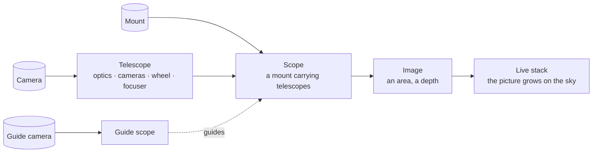
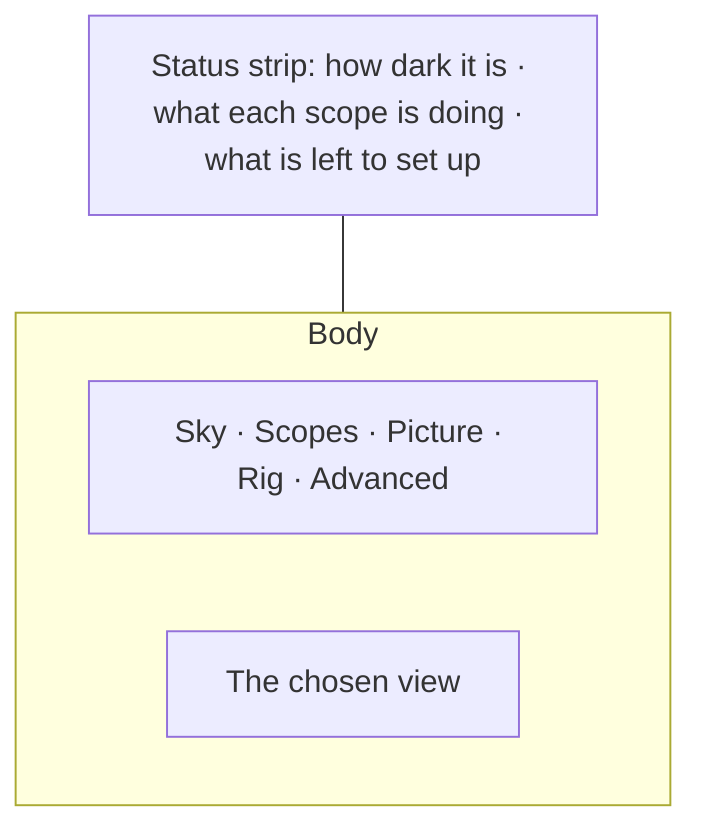
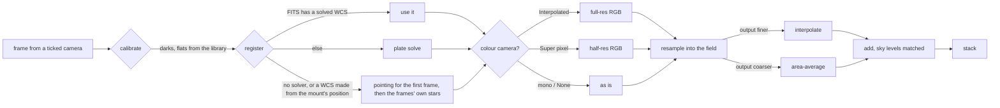

# ELink: user guide

How to run ELink and use it. For how it is built, see the [developer guide](development.md).

## The idea in one picture

You tell ELink **what you want**: *this image of this part of the sky*. Your **scopes** do the rest by themselves: they point,
centre, focus, guide, dither, flip at the meridian, cool their cameras and throw away bad frames. There is no sequence to
write and nothing to keep in step.



- A **telescope** is one optical path: the telescope or lens, the cameras behind it, the filter wheel, focuser and rotator.
  A guide scope is a telescope too.
- A **scope** is a mount carrying one or more telescopes, with everything it does by itself. A scope can contain other
  scopes: a dual rig or a two-mount setup is just a bigger scope.
- An **image** is an area of sky (a single target is just a small area: one frame), how deep it should get, and which scopes
  may work on it.

## The words

| Word | Means |
|---|---|
| **Mount** | The motorised base that points at the sky. |
| **Telescope** | One optical path: the tube or lens, the cameras behind it, and the filter wheel, focuser and rotator. A guide telescope is a telescope. |
| **Scope** | A mount with the telescopes on it, and what it does by itself (guide, centre, focus, flip, dither, cool). It is what you ask for images. |
| **Image** | An area of sky you want, to a depth: the yellow frame on the chart. One frame of your telescope is a small image; a mosaic is a big one. |
| **Panel** | One pointing of a mosaic: a place the telescope is aimed. |
| **Shot** | One exposure of the camera. |
| **Exposure goal** | How long *every part of the image* (every point inside the yellow frame) should be exposed in total, all shots added up. It is not a target and not a panel: a point near the edge of the frame gets its share from the panels that cover it. |

## Starting

You need `indiserver` with your drivers (or the simulators), and the EVent packages in `nuget/` (they are in the repository).

```bash
indiserver indi_simulator_telescope indi_simulator_ccd indi_simulator_wheel indi_simulator_focus
```

```bash
dotnet run --project src/ELink.Station -- --indi localhost:7624
```

That starts everything (INDI bridge, scopes, services, sky atlas, Stellarium link) and opens the window.

| option | meaning | default |
|---|---|---|
| `--profile NAME` | run an equipment profile's drivers (Rig › Devices) | none |
| `--indi host[:port][=name]` | an indiserver to bridge; repeat for several | `localhost:7624` (without a profile) |
| `--port N` / `--listen IP` | mesh port and interface for other ELink processes | `5698`, loopback |
| `--compose file.json` | where your setup is kept (the centring offset, site and so on are saved next to it) | `~/.config/elink/compose.json` |
| `--save-dir DIR` / `--save SHOOTER` | save frames of a camera from the start | none |
| `--stellarium-port N` | telescope port Stellarium connects to | `10001` |
| `--stellarium-remote URL` | Stellarium Remote Control | `http://127.0.0.1:8090` |
| `--sky-data DIR` | KStars sky data | `/usr/share/kstars` |
| `--no-ui` | headless; connect a UI later | |

**Drivers** (recommended): instead of starting `indiserver` by hand, make a profile under *Rig › Devices* (pick your
drivers from the list INDI installed: eqmod, asi, gphoto, ...) and start it there, or at launch:

```bash
dotnet run --project src/ELink.Station -- --profile "My rig"
```

ELink then runs the drivers itself, connects the devices and restarts the server if it dies.

**UI on another machine**: run the station with `--no-ui --listen 0.0.0.0`, then on the other machine:

```bash
dotnet run --project src/ELink.App -- --host <station-ip> --port 5698
```

## The window



- **Sky** (`Ctrl+1`): the sky chart, the image you are planning, the queue. This is where you work.
- **Scopes** (`Ctrl+2`): one card per scope with what it is doing now; the selected one in full.
- **Picture** (`Ctrl+3`): the stack as a finished picture, growing as frames arrive (see below).
- **Rig** (`Ctrl+4`): Devices (drivers and what is plugged in), Set up (telescopes and scopes), Site, Calibration.
- **Advanced** (`Ctrl+5`): the raw INDI properties, where frames are saved, a custom stack.

The **status strip** is always there. Left: how dark it is at your site (click to set the site). Middle: one chip per
scope with what it is doing (idle, slewing, centring, focusing, guiding, exposing 12 of 30, error); click one to open it.
Right: **Ready**, or how many things are left to set up; click it for the list and a button to each. Messages that matter
appear for a few seconds in the corner. A device's own panel (mount, camera, ...) slides in from the right; `Esc` closes it.

Buttons that cannot work are greyed out (Stop while nothing runs, Start while something does).

### First time

With nothing set up the Sky shows a short list: connect your equipment, set up a scope, enter your site, check that a
plate solver is installed. Each line takes you to the place. *Not now* puts it away.

## Rig

### Set up

1. **Telescopes**: *Add a telescope*. Give it a name, its focal length and aperture, and tell it what each camera does:
   **Imaging**, or **Guiding** for an off-axis guider behind the same optics. Add the filter wheel, focuser and rotator if it
   has them. For a **DSLR** (INDI's gphoto, canon or nikon driver) open *This camera does not know its own sensor* and give
   its pixel size and sensor size: those drivers cannot tell, and the telescope hands them over. ELink switches the camera to
   FITS transfer before exposing (native CR2/NEF files cannot be measured or stacked) and sets the ISO you ask for. Raw colour
   frames are debayered by the live stack. The telescope tells its cameras the focal length, so frames carry it.
   - **Gain** and **offset** are used whenever an exposure does not ask for others.
   - **Cool to**: the telescope cools that camera slowly once it is connected (the rate is yours) so the sensor is not
     shocked; a scope waits until its cameras are cold before it exposes (up to 45 minutes, then it goes ahead and says so).
     The scope's panel shows the temperature, with **Cool** and **Warm up** (ramps up to 10 °C, then switches the cooler off).
   - **Focus offsets** (`L=0, R=30, Ha=120`): focuser steps per filter. When the filter changes the telescope moves the
     focuser by the difference, and is not refocused on filter changes.
2. **Scopes**: *Add a scope*. Name it, tick its **mount** and its **telescopes** (as many as ride on the mount; open *Where
   each sits* for their offsets from the pointing axis). The mount's pointer is made for you.
   - **Guiding**: guide with another telescope (a guide scope) or a telescope's off-axis guider, or not at all. *Guiding
     settings*: corrections go to the mount's guide port (pulses) unless you pick another, or "Correction" sends "you are
     here, should be here" to a device that moves itself; the dither interval and size. A guided scope stops guiding before
     a slew, starts (and calibrates the first time) once on target, waits until guiding has settled before each exposure,
     and dithers between them.
   - **Reject bad frames** (on by default): every Light frame is measured (stars, their size and roundness, the sky level)
     against the camera's recent good frames. Clouds, trailing, soft focus or a bright sky mark it *Rejected*: it does not
     count toward an image's depth (the spot is shot again), is not stacked, and storage files it under `rejected/`. After
     three rejected frames in a row the scope waits a little for the sky.
     Judged against the camera's own usual: a camera whose stars are always a little long is not rejected for that; and if the stars
     have been one different size for 6 frames in a row (the focus changed, another telescope) that becomes the new usual, with a note, so
     a night is not rejected for ever. Colour frames are measured as the brightness of 2×2 cells (a raw mosaic makes round stars ragged).
   - **Centre after each slew** (needs a plate solver): after its own slews the scope solves a frame and re-aims by the
     error until it is within the tolerance (no syncs needed). A consistent error (a mount that always lands a few
     arcminutes off) is learned and aimed off on later slews nearby.
   - **Flip at the meridian** (German equatorial mounts; needs the Site): when the target passes the meridian by the set
     minutes the scope finishes the running exposure (or waits for the flip point if the next would cross it), slews to the
     target again so the mount turns over, checks the pier side changed, recalibrates guiding and carries on. An idle scope
     tracking across the meridian flips too.
   - **Autofocus**: every telescope with a focuser is refocused by the scope (with its own camera, all at once) when a
     trigger fires: at the start, every N minutes, when the focuser's temperature has moved by N °C, on a filter change
     (not for telescopes with focus offsets), or when stars have grown by N %. Without "at the start", the first exposure is
     the baseline (you focused by hand). A failed focus is noted and imaging carries on.
   - **Pseudo mono** (a setting of an imaging camera, colour cameras only, no filter wheel): the camera takes turns to focus
     its red, green and blue, one colour per exposure, round and round. Give the telescope focus offsets named `R`, `G`
     and `B` (steps, relative to each other; autofocus settles on green, so `G=0`) and a focuser. Every frame is stored as
     two mono frames, the colour that was in focus in `infocus/` and the average of the other two in `oof/`, both
     super-pixel debayered. In the live stack the in-focus colours make the red, green and blue; the out-of-focus light is
     stacked separately and mixed in as luminance as far as the *Out-of-focus light* slider (Sky › Show, or the stack
     page) says: 0 keeps the colours sharp and leaves that light out (almost no colour fringes from an achromat, at the
     price of about two thirds of the light), 1 uses all of it (more signal, a white halo around the stars instead of a coloured one).
     **Autofocus** knows about it: when a trigger fires the scope focuses green, then red and blue (each from green's focus,
     measuring only that colour's stars in the super-pixel frame), puts the measured differences into the telescope's focus
     offsets `R` and `B` (kept with the composition) and leaves the focuser at green. So the offsets do not need to be
     typed or kept up to date by hand. Without a focuser the camera cannot take turns: focus it by hand for one colour and say which
     (see *Focusing by hand*). The *Pseudo mono picture* selector shows the **colour** picture, the **luminance** (all the
     out-of-focus light as one mono picture) or the **sharp** mono picture (the in-focus colours added up).

Everything that is set up can be **edited** (the form loads what is there) or removed. It is saved and comes back on the next
start. The *Advanced: mount pointers* list is for the curious.

### Equipment

Every device with whether it is connected and what it is doing. **Connect all**, or connect one; **Open** slides its panel in.
Panels cover what the drivers support: the mount (go to, park, tracking, abort), the camera (expose, cooler, binning, latest
frame), the focuser (absolute, relative and timed moves, abort, sync, reverse, backlash, max travel, speed, temperature), the
filter wheel, rotator, dome, weather and GPS. A device that is not connected shows its controls greyed out.

### Site

Set this once: latitude and longitude (degrees, `47.5` or `47:29:52`; east longitudes positive), elevation, or pick a
**GPS** device to take them from (it also reports how far this computer's clock is off). **Lowest altitude** and the
**obstructions** list (`azimuth:altitude` pairs, e.g. `180:10, 200:35, 260:35, 280:10` for a house to the south-west)
describe your real horizon. With *Give the mounts this location and the time* ticked, every mount gets them when it connects.

The page then shows tonight: day, twilight or night, the Sun's altitude, sidereal time, astronomical dusk and dawn, the Moon
(phase, altitude, rise and set) and where the planets are. The Sky draws your horizon, the Sun, Moon and planets, and for any
selection says its altitude now, when it rises, culminates and sets above *your* horizon, how many dark hours it is up, and
how far it is from the Moon.

### Drivers

Profiles of INDI drivers: ELink runs the drivers itself (its own `indiserver`), connects the devices and restarts the server
if it dies.

### Calibration

The library keeps master darks, biases and flats for each camera (each camera of a telescope on its own, e.g.
`main-ZWO_ASI2600MC`). Pick the camera and the kind, then **Capture**:

- **Dark**: cap the scope. Same exposure, gain and sensor temperature as the lights it is for.
- **Bias**: cap the scope. The shortest exposure; used when no dark suits.
- **Flat**: even light over the aperture (a panel, a T-shirt in daylight, the twilight sky), through a **filter**. Leave the
  exposure at 0 and it finds the exposure that fills the camera to *Flat level* (half by default). The dark or bias is taken
  off each flat when the library has one, so take those first.

The frames are combined into a master (for each pixel the mean, leaving out its highest and lowest value: cosmic rays,
flickering pixels) and listed under *Masters* with the camera's gain and temperature. The live stack picks for each frame the
dark of the same camera, size and binning whose exposure, gain/ISO and temperature (within 3 °C) match, else a bias, and the
newest flat of the frame's filter. Masters live in `calibration/` next to the composition file.

## Sky

The chart is built from the sky data KStars installs (about 43 000 stars to magnitude 8, 14 000 deep-sky objects,
constellation figures) plus faint stars for small fields.

- **Move** by dragging, **zoom** with the wheel (towards the pointer) or `+` / `-`, **click** a star or object to select it, **double-click** it to frame it as the image (double-click the frame to zoom to it).
- **Find** by name: `M42`, `NGC 7000`, `Vega`, `andromeda`, `Jupiter`. With several matches, pick one from the list.
- **Right-click** the sky: frame the image here, send the scope here, what is here, centre the chart here.
- **Show** switches the constellations, grid, your horizon, each scope's field and mosaic panels, the stacked image and the
  progress map. Mounts are drawn as reticles where they point; **Mount** jumps there.
- The panel on the right can be folded away (*Hide panel*) for more sky.
- **Stellarium**: show the selection in it, take its selection, or make it follow a scope. In Stellarium: Telescope Control →
  add telescope → External software or a remote computer, host `localhost`, port `10001` (`--stellarium-port`), equinox
  J2000; enable the Remote Control plugin (port 8090) for the show/take buttons.

### Tonight's best

The top of the Sky panel suggests what is worth imaging **tonight** at your site (set your location under Rig › Site first). For every
deep-sky object in the atlas it works out how long it is high enough above your horizon during the dark hours (higher counts more),
how bright its surface is (what a short night can show), how well it fills your smallest frame (or how many panels it would take), and how
far it is from the Moon, and lists the best ones with the reason: *"up 9.3 good hours, peaks at 84°, fills 100% of your frame, Moon 82° away"*.
Nebulae and galaxies rank above star clusters; the same object under two designations is listed once. **Click one** and it becomes the
image to take (centred, framed to your scope). The list follows the frame size of your scopes and refreshes every 20 minutes.

### Framing from a picture

*Frame from a picture…* (in the Target card) takes a photo of the sky (a PNG, JPEG or TIFF from any camera or telescope, or a FITS
frame), plate solves it (blind for a plain picture; a FITS gives its pointing and scale as hints), and then:

- shows the picture on the chart exactly where it lies on the sky (untick *Show the picture on the chart* to hide it, *Remove* to forget it);
- makes the image to take **exactly one frame of it**: the same centre, the same size and the same turn.

So you can frame by what you already shot, or by a picture of the field from another telescope, and let the dynamic frame take over from
there. It needs a plate solver (ASTAP or astrometry.net); the message says if it could not solve it.

### Imaging an area

Select an object and press **Frame this** (big objects become an area, small ones one frame), or just drag the yellow frame
where you want it. The frame is the image:

- **Drag** it to move it, a **corner** to resize it, the **round handle** to turn it. The numbers in the panel follow, and you
  can type them instead. *Just one frame* sets it back to one frame of your smallest telescope.
- Each scope's own field is drawn at the centre in its own colour, and for a mosaic the **panels**; the panel says how many and
  roughly how long it will take (*"1.95° × 1.5° · 3 × 3 panels · roughly 9 h with 1 scope"*).
- The frame also works for **large areas**: up to 60° on a side, with edges drawn as the great circles they are, and the
  stacked picture laid in tiles so it follows the curvature of the sky. An area reaching a celestial pole is refused (its
  tiling is undefined there).

Then choose the *Exposure goal* (how long every part of the image should be exposed in total; 0 = until you stop it), the shot
length, which scopes share the work, and press **Start**. *More options*: filter, ISO, dither, panel spacing, a shot limit,
the output scale, a weather device that pauses it, *Start afresh* and *Check the plan*. Each scope takes the next spot for its
own frames as soon as it is free (spots another scope already covered are skipped, scopes are never kept in step, a slow
mount takes fewer shots), and guides, dithers, flips and focuses by itself.

**Data layers** (*More options*, advanced) make an image out of several kinds of data. *Add a layer* gives a row with a name, a
filter, a finest and a coarsest pixel scale (″/px, 0 = no limit) and an exposure goal. For example a fast wide scope can build a deep,
coarse base while a long focal length scope adds the detail:

| Name | Filter | Finest | Coarsest | Goal |
|---|---|---|---|---|
| base | L | 4 | 10 | 30 min |
| detail | L | 0 | 2 | 120 min |

A frame feeds **every** layer whose filter it was shot through and whose range holds its pixel scale (a frame at 1.5″/px feeds
both layers above; one at 6″/px only the base). Each layer is its own channel of the coverage map, so each scope only works
on what its cameras can feed, the shot goes through the layer's filter, and a layer is finished when every spot has its
depth. Scopes stay on a filter for a while rather than changing at every shot. The progress map shows the least advanced
layer at each spot, the progress card each layer. The live stack keeps one stack per layer (pick it in the stack's filter
list); frames no layer takes are left out. With several layers the picture is the **combined** one: the coarsest layer is the base, and each finer layer adds what it
resolves that the base cannot (itself less a blur to the coarser layer's resolution, scaled so both agree on how much light there
is); where a finer layer has no data yet the base shows as it is. Pick one layer's own stack to see it alone. A layer that no camera of the chosen scopes can feed is refused, with the scales
there are. Leave the box empty for one layer of everything.

While it works the picture builds **on the sky** where the image is, with the progress map over it (blue not yet, yellow deep
enough) and each scope's outline where it shoots. *Pause*, *Resume* and *Stop* appear when they apply.

**Over several nights**: an image is kept under its name (coverage after every shot, the stack every few minutes and when it
stops). *Images kept from earlier nights* lists them: *Load* one and press Start to carry on where it was. A different area
under the same name is refused; tick *Start afresh* to replace it.

### Queue

*Add to queue* puts the image on the queue instead of starting it. Each entry has a **priority**, a **minimum altitude**
(0 = your site's horizon), **only when dark**, how far it must be **from the Moon** and how bright a Moon (**% lit**) it
tolerates; changes apply by themselves. **Run**: every minute the queue looks at the sky (the site must be set) and takes the
best image that is possible now *and* stays possible for at least half an hour: higher priority first, then whatever sets
soonest. When an image stops being possible (it sets, dawn, the Moon) it is stopped and kept; when it is deep enough it is
done. Each entry says why it waits ("too low, rises 23:10", "not dark", "12° from the Moon"...). Left running, it carries on
the next night by itself.

## Picture

The **Picture** page is the live stack made into a picture you can look at, and it updates by itself while the image is being taken.

- **It grows in front of you.** Every time a frame is added to the stack, a white shape lights up where it landed and fades away; a
  moment later the picture updates and fades from the old version to the new one.
- **Gradient removal.** Light pollution, the Moon and vignetting make one side of a picture brighter. ELink samples the sky in a grid of
  boxes (the faint pixels of each, away from the stars), fits a smooth surface to the samples, leaves out the samples that sit above it
  (nebulae, galaxies) and fits again, then takes the model away. *How uneven the sky is* is how flexible the surface may be (1 is a plain
  tilt, 6 follows complicated glows but may start to take faint nebulosity with it); *Vignetting* divides instead of subtracting.
- **Automatic stretch.** A stack is linear: a faint nebula is almost black. The stretch puts the sky at the *Sky brightness* you choose and
  lifts the faint end (a midtones transfer function, the way PixInsight's and N.I.N.A.'s screen stretch works). *Black point* sets how
  far below the sky black is. *Same stretch for all colours* keeps the colour balance.
- **Colour.** *Make the sky neutral* gives every colour the same sky level, *Saturation* and *Reduce green* are for taste.
- **Looks:** *Natural*, *Punchy*, *Gentle* and *Linear* (the data as it is) are starting points.
- **Hold to see it before processing** shows the same data with only a plain automatic stretch.
- **Picture of:** the stack to look at: everything together, or one filter or layer on its own. With a pseudo mono stack the picture
  selector and the out-of-focus slider are here too.
- Scroll to zoom towards the pointer, drag to move, double-click to fit; the histogram shows how the brightness is spread.

**Saving.** *Save* writes the stack as it really is, **linear and unstretched** (a 32-bit FITS, everything you can process anywhere
else) and the picture as it is now (a 16-bit PNG, with a small file of the settings), in the station's `pictures` folder
(`--save-dir`). The linear stack is also kept next to every kept image (`stacks/<name>/linear.fits`), so nothing depends on pressing
Save. Processing never changes the stack.

## Scopes

The list on the left shows each scope with what it is doing and how far along; the selected one has its pointing, the latest
frame, **What it did** (each change of what it was doing, with the time), the guiding graph (RA blue, Dec red, ±4″) and the cooling. You do not need the buttons: the scope does it by itself.
*Manual control* is for testing: go to coordinates and take frames. *Autofocus* (sweep a focuser, measure star size, fit the
curve, move to the best position) and *Centring* (the older mount-level service, which also catches slews made from a hand
controller) are here too.

### Focusing by hand

Most things also work without the automation. **Focus helper** (Scopes › *Focus helper*) is for a system you focus by hand: pick a
camera and press Start, and it takes short pictures over and over and shows the star size (HFR, smaller is sharper), the
roundness, how many stars, whether the last few pictures are *getting sharper* or *softer*, the sharpest so far and a graph of
the history. For colour cameras each colour is measured on its own (a colour in the graph each), which is how you see which colour
you have focused. It warns when the stars are saturated or missing, moves nothing, and can be left running while you work.
A **pseudo mono** camera without a focuser works too: focus it by hand for one colour and say which in its scope's panel
(*Pseudo mono, focused by hand*); its frames are tagged with that colour and stacked as described above.

### Plate solving

ELink needs a plate solver for centring and for stacking frames that carry no sky position: **ASTAP** (`astap_cli` or
`astap`, with one of its star databases such as D50; found in `~/.local/astap`, `/opt/astap` or on the PATH, or set
`ELINK_ASTAP`) and/or astrometry.net's `solve-field` (a user-space copy in `~/.local/astrometry` is found automatically, or
set `ELINK_SOLVE_FIELD`). With both, ASTAP is tried first when ELink knows roughly where the scope points and astrometry.net
first for blind solves; whichever fails hands over to the other. A solve that fails with a scale hint is tried again without
it. The station prints which it found.

## Advanced

- **INDI properties**: every property of every INDI device, raw: browse and edit anything the typed panels do not cover.
- **Saving frames**: pick a directory (**Use**), then tick *Save its frames* for each camera or scope. Frames go to one folder
  per night, with FITS headers filled in (object, pointing, filter, exposure) and a session log.
- **Custom stack**: stack the frames of cameras you choose into a field you choose (an image run already builds its own).

### How the live stack works



- **Field and output**: the centre, size and turn of the field, and the **pixel scale** in arcsec per pixel (smaller than the
  camera's: interpolated, bicubic by default; larger: each output pixel is the average of everything under it; `0` = the
  first frame's). *Memory limit* refuses fields that would be too large.
- **Registration**: how each frame is placed on the sky. *Auto* uses a WCS already in the FITS when a plate solver wrote it (a CD or PC
  matrix, or `PLTSOLVD`); otherwise it plate solves (the frame's own pixel scale is the hint, so it is quick) when a solver is on the
  mesh. Without a solver, or when the solve fails or the WCS was only made up from the mount's position (INDI writes CDELT and CROTA, the
  same for every frame whatever the sky did): the first frame is placed by where the mount said it pointed, the scale its telescope has and
  how its camera is turned; **every later frame is matched to the frames already placed by its stars, with any shift, turn and scale**. So
  frames of different telescopes and cameras go into one stack, a camera that was turned by hand is no problem, and a frame that matches
  one placed frame is as good as one that matches them all. The message says how many stars matched and what shift, turn and scale it
  found. A frame whose stars match none keeps the pointing's placement and says so. *Solve* always solves; *Pointing* needs no solver but
  only the frame scale and angle, and is as accurate as your mount. The scale and angle come with each frame from its telescope (so a scope
  with a wide and a long telescope is fine), or from the frame's `SCALE` card, or from the *frame scale* you give. (Found with real frames:
  lined up by the WCS INDI wrote, a stack of 12 smeared into trails and the brightness matching scaled the frames to a fifth; lined up by
  stars, 145 stars matched and it came out sharp. A 300 mm and a 900 mm session of M 42 in one folder, the camera turned 13° between them,
  went into one stack.)
- **Colour (Bayer) frames** are debayered before stacking: *Interpolated* (full resolution), *Super pixel* (each 2×2 cell one
  RGB pixel, half the resolution, no interpolation artefacts, faster), or *None* (the raw mosaic as mono). The pattern comes
  from the frame's `BAYERPAT`; pick one if the camera does not write it.
- **Quality**: *Reject outliers* leaves out what does not belong in a pixel (satellite and plane trails, cosmic rays) once it
  has a few frames; *Match brightness* scales every frame to the stack's stars, so frames from other cameras and scopes (or
  through thin cloud) blend in; *One stack per filter* keeps Ha, OIII, L, R, G, B apart; *Balance background and colour* gives
  colour stacks a neutral sky and white stars.
- **Calibrate** (on by default): every raw frame has its dark taken off and is divided by its flat, from the library, when it
  has masters that suit. The status says *dark+flat* when it did.

Only Light frames are used. The stack can be fetched as a 32-bit FITS with a WCS through `ELink.Automation.LiveStack.GetImage`.

## Troubleshooting

| symptom | check |
|---|---|
| no equipment | Is `indiserver` running and given with `--indi` (or a profile started)? Rig › Devices › *Look again*. |
| "Ready" says a thing is missing | Click it: each line takes you to where it is fixed. |
| the Set up page refuses a scope | The red line under its buttons says why (no mount ticked, no telescope, a camera already in another telescope...). |
| centring says "no solver" | The status strip's list shows it; install ASTAP or astrometry.net, or set `ELINK_ASTAP` / `ELINK_SOLVE_FIELD`. |
| solves fail | Exposure long enough for stars? Focus? Focal length and pixel size right (a wrong scale hint is retried without)? |
| the stack stays empty | A telescope with a pixel size and sensor size filled in for a camera that reports its own (only DSLRs need them) makes frames the wrong size. |
| scope stays "Slewing" | The mount is parked or not tracking: unpark it in Rig › Devices › Open. |
| Stellarium shows no telescope | Equinox must be J2000; the port must match `--stellarium-port`. |
